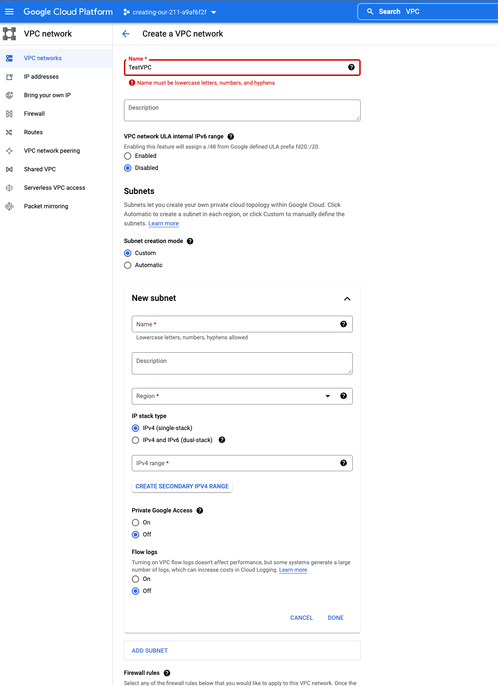

**Add a cover photo like:**

ACG - Create Our First VPC in Google Cloud

## Introduction

I picked this project becuase to get more familar with creating my own network in GCP. This is a handson lab from GCP. 
https://learn.acloud.guru/handson/2ed35bb7-9756-4b29-b86e-e515d26c8d60

## Prerequisite

You would need a GCP account in irder to do the lab

### Step 1 — Summary of Step

Set up VPC via CLI and GUI

## Social Proof

✍️ Show that you shared your process on Twitter or LinkedIn

[Twitter](https://twitter.com/roylink/status/1531256734588751872)
