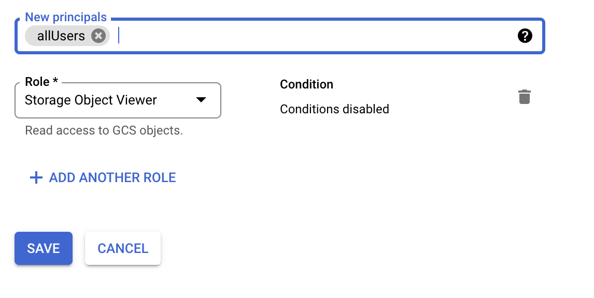
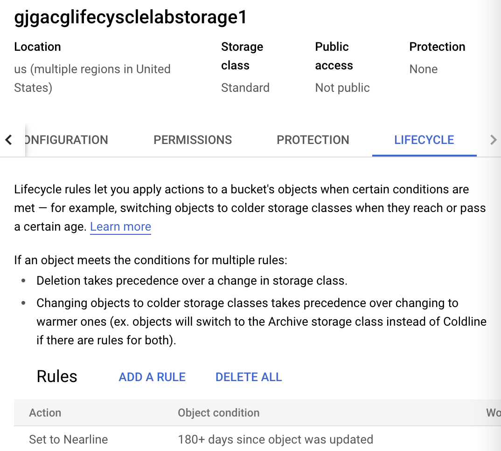

<!-- This is a template you can use for quick progress days. It removes a lot of the steps we encourage you to share in the longer template 000-DAY-ARTICLE-LONG-TEMPLATE.MD-->

# ACG - Cloud Storage labs

## Cloud Research

**  Creating a Folder and Uploading an Object in Cloud Storage **

Needed to just modified permitions for Google Cloud Storage

** Setting Cloud Storage Lifecycle Rules **
Set lifecycle policy

CLI - view bucket lifrcycyle:
    gsutil lifecycle get gs://<BUCKET_NAME>

Set via JSON file
    git clone https://github.com/linuxacademy/content-gc-essentials
    cd content-gc-essentials/cloud-storage-lifecycle-lab
    gsutil lifecycle set delete-after-two-years.json gs://<BUCKET_NAME>

** Object Versioning in Google Cloud Storage **
In the Cloud Shell, check the current versioning policy of our bucket:
    gsutil versioning get gs://(PROJECT-ID)-versioning-lab
Enable versioning in the storage bucket:
    gsutil versioning set on gs://(PROJECT-ID)-versioning-lab
Copy the file to the cloud storage bucket:
    gsutil cp <file>  gs://<bucket>
convert the file from an archived to a live state.:
    gsutil mv gs://<file path>#(GENERATION_NUMBER) gs://<file path>
## Social Proof

[Twitter](https://twitter.com/roylink/status/1533144481771536385)
